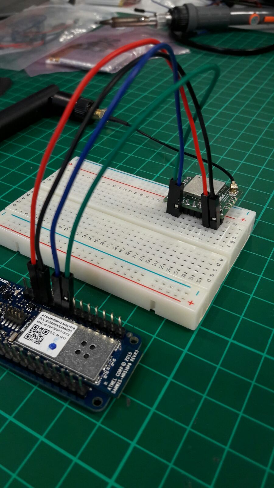
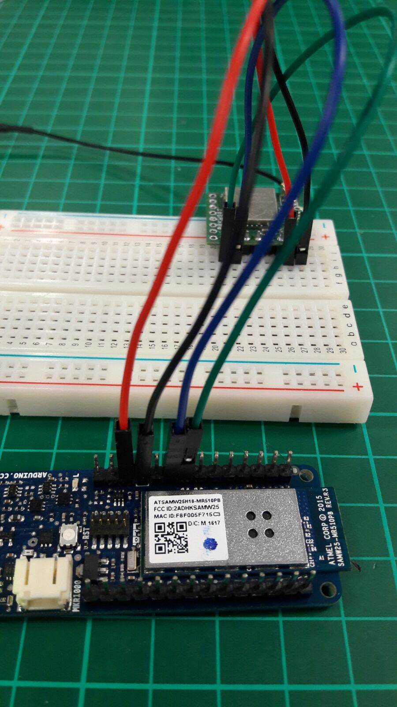
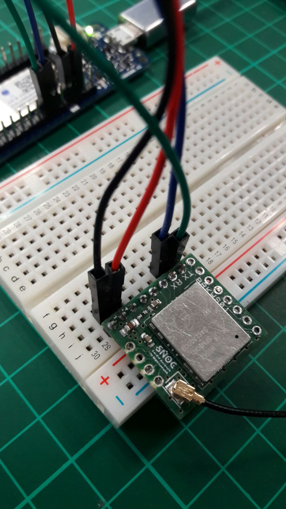
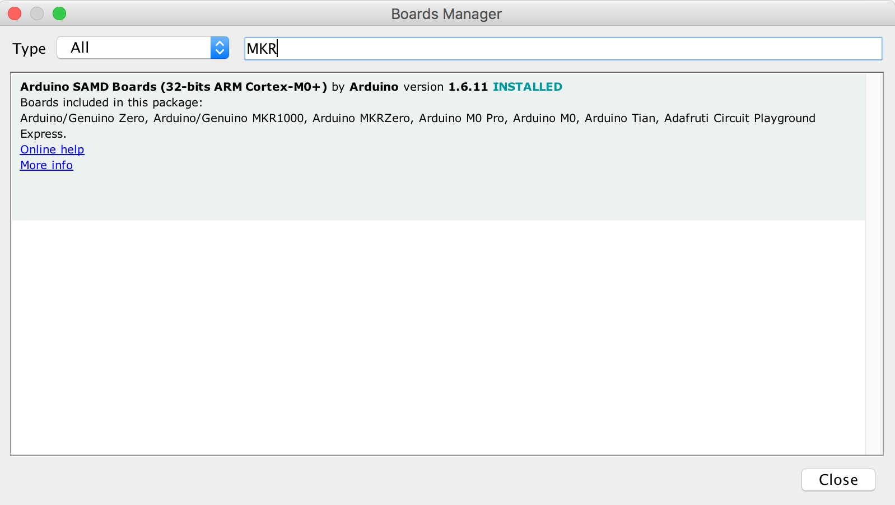

# MKR1000-SNOC
This arduino example will show you how to send a Sigfox message the MKR1000 and using the SNOC wisol module.

## Hardware Requirements
* [Arduino MKR1000](https://store.arduino.cc/product/GBX00011)
* [SNOC Breakout Board - Sigfox BRKWS01](https://yadom.fr/carte-breakout-sfm10r1.html)

## Module Schematics

* SNOC Breakout Board:


* Arduino MKR1000:


## Wiring


Thank you [framboise314](http://www.framboise314.fr/carte-de-prototypage-sigfox-par-snoc/) for this connection picture!








## Install Arduino MKR1000 on Arduino IDE

* Get the lastest arduino IDE [here](https://www.arduino.cc/en/main/software).
* Go to Tools > Boards
* Go to Boards Manager and look for MKR1000: 

* Select the Arduino/Guenuino MKR1000:


## Send your first message

Copy past this code in a new project (or open MKR1000-SNOC you've just cloned):

```
/*
 * Author: Louis Moreau: https://github.com/luisomoreau
 * Date: 2017/03/03
 * Description:
 * This arduino example will show you how to send a Sigfox message
 * using the wisol module and the MKR1000 (https://yadom.fr/carte-breakout-sfm10r1.html)
*/


//Set to 0 if you don't need to see the messages in the console
#define DEBUG 1

//Message buffer
uint8_t msg[12];

// the setup function runs once when you press reset or power the board
void setup() {
  // initialize digital pin LED_BUILTIN as an output.
  pinMode(LED_BUILTIN, OUTPUT);
  if(DEBUG){
    Serial.begin(9600);
  }

  // open Wisol communication
  Serial1.begin(9600);
  delay(100);
  getID();
  delay(100);
  getPAC();
}

// the loop function runs over and over again forever
void loop() {
  msg[0]=0xC0;
  msg[1]=0xFF;
  msg[2]=0xEE;

  sendMessage(msg, 3);

  // In the ETSI zone, due to the reglementation, an object cannot emit more than 1% of the time hourly
  // So, 1 hour = 3600 sec
  // 1% of 3600 sec = 36 sec
  // A Sigfox message takes 6 seconds to emit
  // 36 sec / 6 sec = 6 messages per hours -> 1 every 10 minutes
  delay(10*60*1000);
}

void blink(){
  digitalWrite(LED_BUILTIN, HIGH);   // turn the LED on (HIGH is the voltage level)
  delay(1000);                       // wait for a second
  digitalWrite(LED_BUILTIN, LOW);    // turn the LED off by making the voltage LOW
  delay(1000);    
}

//Get Sigfox ID
String getID(){
  String id = "";
  char output;

  Serial1.print("AT$I=10\r");
  while (!Serial1.available()){
     blink();
  }

  while(Serial1.available()){
    output = Serial1.read();
    id += output;
    delay(10);
  }

  if(DEBUG){
    Serial.println("Sigfox Device ID: ");
    Serial.println(id);
  }

  return id;
}


//Get PAC number
String getPAC(){
  String pac = "";
  char output;

  Serial1.print("AT$I=11\r");
  while (!Serial1.available()){
     blink();
  }

  while(Serial1.available()){
    output = Serial1.read();
    pac += output;
    delay(10);
  }

  if(DEBUG){
    Serial.println("PAC number: ");
    Serial.println(pac);
  }

  return pac;
}


//Send Sigfox Message
void sendMessage(uint8_t msg[], int size){

  String status = "";
  char output;

  Serial1.print("AT$SF=");
  for(int i= 0;i<size;i++){
    Serial1.print(String(msg[i], HEX));
    if(DEBUG){
      Serial.print("Byte:");
      Serial.println(msg[i], HEX);
    }
  }

  Serial1.print("\r");

  while (!Serial1.available()){
     blink();
  }
  while(Serial1.available()){
    output = (char)Serial1.read();
    status += output;
    delay(10);
  }
  if(DEBUG){
    Serial.println();
    Serial.print("Status \t");
    Serial.println(status);
  }
}

```

Run this code and you should see the following results in the console:


## Additional content

* [Framboise314](http://www.framboise314.fr/carte-de-prototypage-sigfox-par-snoc/)


* [Tutos Instructables](www.instructables.com/member/luisomoreau/)


* [Tutos Hackster](https://www.hackster.io/luisomoreau)
